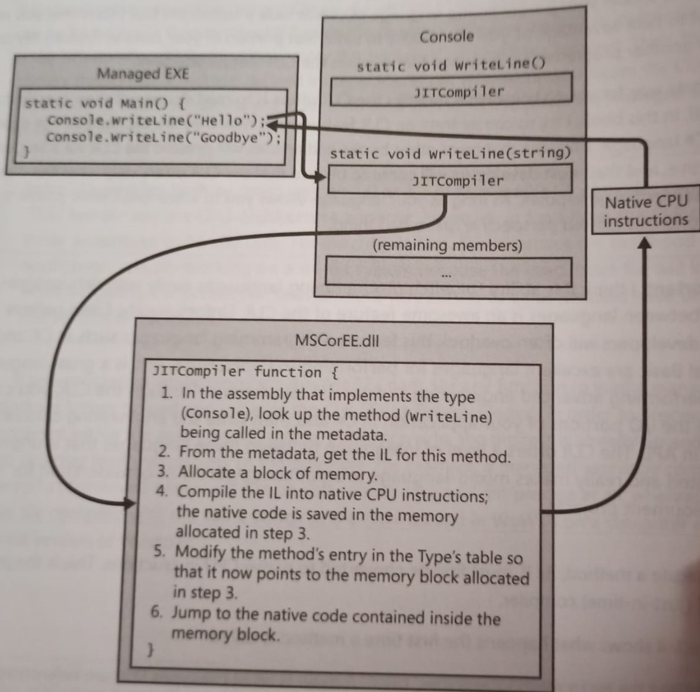
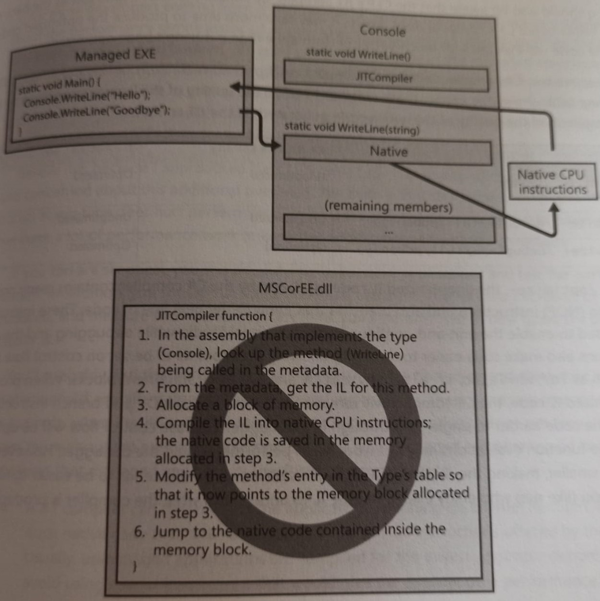
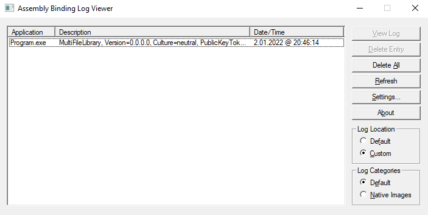
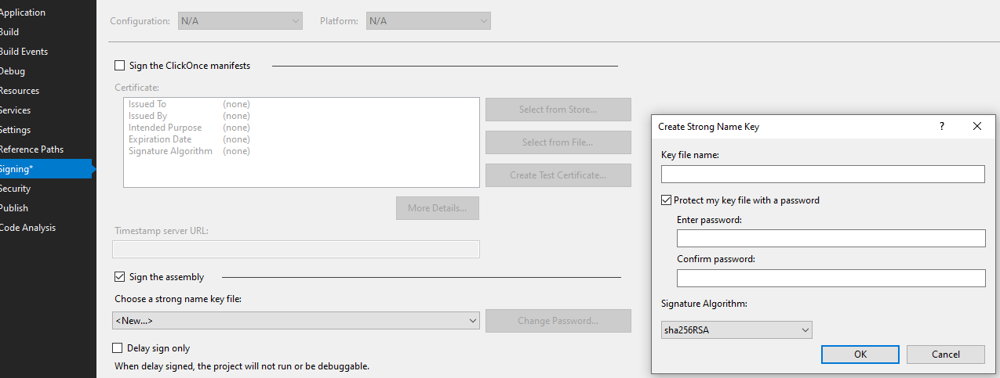

# CLR via C# (Fourth Edition) by Jeffrey Richter
## Notes from CLR via C# written by Jeffrey Richter


### This repository contains notes taken from book CLR via C#(Fourth Edition),written by Jeffrey Richter, with examples.

# PART 1

- CLR is just what its name says it is: a runtime that is usable by different and verified programming language.
- **CLR has no idea which programming language the developer used for the source code.**
- You can create source code files written in any programming language that supports the CLR.

**A managed module is a standard 32-bit Windows (P)ortable (E)xecutable (PE32) file or a standard 64bit Windows portable executable (PE32+) files** requires the CLR to execute.

**IL codeis sometimes referred to as managed code because CLR manages its execution**

### Metadata has many uses:
- Compiler can read metadata directly.
- Intellisense feature parses metadata to tell you.
- By specifiying the `CLR` command-line switch, the C++ compiler produces modules that contain managed code.

**C++ is unique in that it is the only compiler that allows the developer to write both managed and unmanaged code**


- **You can tell if .NET Framework has been installed by looking for the `MsCorEE.dll` file in the `%SystemRoot%\System32` directory. The existence of this file tells you that .NET FW is installed.** 

- If you want to determine exactly which versions of the .NET FW are installed. Examine the subdirectories under the following directories.
    - `%SystemRoot%System32\Microsoft.NET\Framework`
    - `%SystemRoot%System32\Microsoft.NET\Framework64`


- .NET FW SDK includes a command-line utility called `CLRVer.exe` that shows all of the CLR versions installed on a machine.
- The utility can also show which version of CLR is being used by process

- Microsoft ships two SDK Command Line utilities `DumpBin.exe` and `CorFlags.exe`.

### `DumpBin.exe`
> The Microsoft COFF Binary File Dumper (DUMPBIN.EXE) displays information about Common Object File Format (COFF) binary files. You can use DUMPBIN to examine COFF object files, standard libraries of COFF objects, executable files, and dynamic-link libraries (DLLs).

e.g: `dumpbin.exe /all /out:dump-bin-out.txt DumpBinSample.exe`

gives dump output file.

### `CorFlag.exe`
> The CorFlags Conversion tool allows you to configure the CorFlags section of the header of a portable executable image.

### 64-bits versions of windows offer a terminology that allows 32-bit Windows application to run. This technology is called `WoW64 (Windows On Windows64)`

- ### After Windows has examined the EXE's file header to determine whether to create 32-bit or 64 bit process, Windows loads the `x86`, `x64` or `ARM` versions of `MsCorEE.dll` into process address space.

**You can think of IL as can object oriented machine language.**

- A performance hit is incurred only the first time a method is called. All subsequent calls to the method execute at the full speed of the native code, because verificatin and compilation to native code don't need to be performed again.

**Calling for first time.**


**Calling for second time.**



### ILAsm.exe

> The IL Assembler generates a portable executable (PE) file from intermediate language (IL) assembly. You can run the resulting executable, which contains IL and the required metadata, to determine whether the IL performs as expected.


`ilasm examples/ilasm/sample.il /output:hello_world.exe`

You can find sample IL code in `examples/ilasm/sample.il` file.

### ILDasm.exe

> The IL Disassembler is a companion tool to the IL Assembler (Ilasm.exe). Ildasm.exe takes a portable executable (PE) file that contains intermediate language (IL) code and creates a text file suitable as input to Ilasm.exe.

`ildasm examples/ildasm/hello_world.exe /output:examples/ildasm/hello.il`

Output of `hello.il`:

```
//  Microsoft (R) .NET Framework IL Disassembler.  Version 4.8.4084.0
//  Copyright (c) Microsoft Corporation.  All rights reserved.
// Metadata version: v4.0.30319
.assembly extern mscorlib
{
  .publickeytoken = (B7 7A 5C 56 19 34 E0 89 )                         // .z\V.4..
  .ver 2:0:0:0
}
.assembly sample
{
  .custom instance void [mscorlib]System.Runtime.CompilerServices.CompilationRelaxationsAttribute::.ctor(int32) = ( 01 00 08 00 00 00 00 00 ) 
  .hash algorithm 0x00008004
  .ver 0:0:0:0
}
.module sample.exe
// MVID: {D2503C99-2A0C-474A-8F6B-7A6DFDF99208}
.imagebase 0x00400000
.file alignment 0x00000200
.stackreserve 0x00100000
.subsystem 0x0003       // WINDOWS_CUI
.corflags 0x00000001    //  ILONLY
// Image base: 0x06BF0000

// =============== CLASS MEMBERS DECLARATION ===================
.class public auto ansi beforefieldinit Hello
       extends [mscorlib]System.Object
{
  .method public hidebysig static void  Main(string[] args) cil managed
  {
    .entrypoint
    // Code size       13 (0xd)
    .maxstack  8
    IL_0000:  nop
    IL_0001:  ldstr      "Hello World!"
    IL_0006:  call       void [mscorlib]System.Console::WriteLine(string)
    IL_000b:  nop
    IL_000c:  ret
  } // end of method Hello::Main

  .method public hidebysig specialname rtspecialname 
          instance void  .ctor() cil managed
  {
    // Code size       7 (0x7)
    .maxstack  8
    IL_0000:  ldarg.0
    IL_0001:  call       instance void [mscorlib]System.Object::.ctor()
    IL_0006:  ret
  } // end of method Hello::.ctor

} // end of class Hello

// =============================================================
// *********** DISASSEMBLY COMPLETE ***********************
```

- The JIT compiler stores the native code CPU instructions in dynamic memory. This means that the compiled code is discarded when the application terminates.

`Debug: /optimize- /debug:full`

`Release: /optimize+ /debug:pdbonly`

Managed applicaitons could actually outperform unmanaged application.

- A JIT compiler can determine if the application is running on Intel Pentium 4 CPU and produce native code that takes advantage of any special offered by Pentium 4.
- IL is stack based which means all of its instructions push operands onto an execution stack and pop results off the stack.
- While compiling IL into native CPU instructions, the CLR performs a process called `verification`.
- C# compile requires you to compile the source code by using the /unsafe compiler switch.
- **`PEVerify.exe`, which examines all of an assembly's methods and notifies you of any methods that contain unsafe code.**

> The PEVerify tool helps developers who generate Microsoft intermediate language (MSIL) (such as compiler writers and script engine developers) to determine whether their MSIL code and associated metadata meet type safety requirements.

### `NGEN.exe`

> The Native Image Generator (Ngen.exe) is a tool that improves the performance of managed applications. Ngen.exe creates native images, which are files containing compiled processor-specific machine code, and installs them into the native image cache on the local computer. The runtime can use native images from the cache instead of using the just-in-time (JIT) compiler to compile the original assembly.

- Ngen.exe compiles native images for assemblies that target the .NET Framework only. The equivalent native image generator for .NET Core is CrossGen.
    - Startup performance
    - Reducing an app's working set.

- A new assembly file containing only this native code instead of IL code is created by `NGEN.exe`. This new file is placed in a folder under the directory with a name like `%SystemRoot%\Assembly\NativeImages_V4.0####_64`

- Managed code can easily call functions contained in DLL's by using a mechanism called `P/Invoke`.

### Compile the code (Please, see example folder: `examples/hello_world_for_csc_exe`)

`csc.exe /out:Program.exe /t:exe /r:MsCorLib.dll Program.cs`

- MsCorLib.dll automatically refereced, we can omit it.

### Windows supports three types of applications.

- To build a console user interface (CUI) => `/t:exe`
- To build a graphical user interface (CUI) => `/t:winexe`
- To build windows store app => `/t:appcontainerexe`

### Response File
- This file contains switch option to build it.

Please, see example folder: `examples/response_file`

`csc.exe @MyProject.rsp A.cs B.cs`

Note: `@` is required to build the source with response file.

#### `%SystemRoot%\Microsoft.NET\Framework64\VXXX` contains default global `csc.rsp` file.

### Referencing assembly

**When you use the `/reference` compiler switch to reference an assembly, you can specify a complete path to a particular file. However, if you don't specify a path, the compiler will search for file in the following places. (ordered listed)**

- Working directory
- The directory that contains the `csc.exe` file itself.
- Any directories specified `/lib` compiler switch.
- `LIB` environment variable.

=> Managed PE file has four main parts.
- PE32(+) header: is the standard information that windows expects.
- CLR header: is a small block of information that is specific o modules that require the CLR 
    - The header includes the major and minor version number of the CLR that module was built for.
        - Module's entrypoint
        - Optional strong name digital signature
- Metadata: is a block of binary data that consists of several table. There are three categories of tables.
    - Definition tables.
    - Reference tables.
    - Manifest tables.
- IL

To see metadata tables, execute following command.
`ILDASM Program.exe`

### Using Assembly Linker:

- `csc /t:module RUT.cs`
- `csc /t:module FUT.cs`
- `al /out:MultiFileLibrary.dll /t:library FUT.netmodule RUT.netmodule`

### Assembly Version:  
- This version is stored in AssemblyDef manifest metadata table. The CLR uses this version number when binding to strongly named assembly. This number is extremely important and is used to uniquely identify an assembly. When starting to develop an assembly, you should set the major, minor, build and revision number and shouldn't change them until you are ready to begin work on the next deployable version of your assembly.

- When Assembly-A references a strongly named Assembly-B, Assembly B's version is embedded inside Assembly-A's AssemblyRef table's entry. This way, when CLR need to load Assembly-B, it knows exactly which version Assembly-A was built.

- An assembly that isn't assigned a culture is referred to as being **culture neutral**

- If you're designing an application that some culture specific resource to it, Microsoft highly recommends that you create one assembly that contains your code and your application's default resources. When building, this assembly don't specify a culture.

- Now you can create one or more separate assemblies that contain only culture-specific resources-no code at all.

- Assemblers that are marked with a culture are called satellite assemblies. For these satellite assemblies, assign a culture that accurate reflects the culture of the resource placed in assembly. You should create one satellite assembly for each culture you intend to support.

- You should use `AL.exe` tool to build a satellite assembly. You won't use a compiler because satellite assembly should have no code contained within it. When using `AL.exe`, you specify the desired culture by using the `/culture: text` switch, where text is a string such as `en-us`

- `MSI` file can also install any prerequiste components such as `.NET FW` and `SQL Server`.

- Assemblies deployed to the some directory as the application called `privately deployed` assemblies because assembly files can't be shared with any other application.

### **Simple Administrative Control (Configuration)**

Please, see example folder `examples/assembly_binding`

- The Program.cs references `MultiFileLibrary.dll` contains `FUT.netmodule` and `RUT.netmodule`.
  1. Source code of Program.cs is like that:

  ```
  using System;
  using System.Collections.Generic;
  using System.Linq;
  using System.Text;
  using System.Threading.Tasks;

  using AssemblyLinker;

  namespace AssemblyBinding
  {
      class Program
      {
          static void Main(string[] args)
          {
              FUT f = new FUT();
              var result = f.Add(2,3);
              Console.WriteLine("Hello Assembly Binding.");
              Console.WriteLine("Sum operation is done by .netmodule.");
              Console.WriteLine($"Result: 2 + 3 = {result}");
              Console.ReadLine();
          }
      }
  }
  ```
  2. Compile source code following command:
      - `csc.exe /out:Program.exe /t:exe /r:MultiFileLibrary.dll Program.cs`

  3. When running the Program.exe, if we delete `MultiFileLibrary.dll`, we will get exception `Unhandled Exception: System.IO.FileNotFoundException: Could not load file or assembly 'MultiFileLibrary, Version=0.0.0.0, Culture=neutral, PublicKeyToken=null' or one of its dependencies. The system cannot find the file specified.`

  4. But we can add `.config` file for assembly binding to runtime binding for assemblies:
  ```
  <configuration>
    <runtime>
      <assemblyBinding xmlns="urn:schemas-microsoft-com:asm.v1">
        <probing privatePath="AuxFiles" />
      </assemblyBinding>
    </runtime>
  </configuration>
  ```

Notes:
- Whenever the CLR attempts to locate an assembly file, it always looks in the applications directory first and if it can't find the file there, it looks in the `AuxFiles` subdirectories.

- You can specify the multiple semicolon delimited paths. Each path is considered relative to app's basedir.

- Appdir can have folder with assembly name. For example, Program.exe location path can contain folder named `MultiFileLibrary` without configuration file. Similar to the other, `AuxFiles` can contain `MultiFileLibrary` folder with `Program.exe.config`

### Fuslogvw.exe

> The Assembly Binding Log Viewer displays details for assembly binds. This information helps you diagnose why the .NET Framework cannot locate an assembly at run time. 

Note: Fuslogvw.exe Screenshot


### **Strong named assemblies**

- Strongly named assemblies and weakly named assemblies use same portable exacutable(PE) file format.
  - PE32(+) Header
  - CLR header
  - Metadata
  - Manifest
  - IL

- Strongly named assemblies are signed with publishers public/private key pair that uniques identifies the assembly publisher.

- This key pair allows the assembly to be uniquely identified, secured and versioned.

- Strongly named assembly consists of
  - A File name
  - A version number
  - A culture identity
  - A public key

- Very large public key => Retrieved from hash. It is called publickey token.

**To generate a public/private key pair, you should run `SN.exe` as follows:**

`SN -k MyCompany.snk`

This commands creates a file contain public and pivae key with binary format. After public key is created, you can use SN.exe again to see actual public key following command.

`SN -p MyCompany.snk MyCompany.Publickey sha256`

- Public key token is a 64-bit hash of the public key.

**You can sign assembly with `Project Settings->Signing->Check Sign the assembly`**



### Global Asssembly Cache (GAC)

GAC Location: **%SystemRoot%\Microsoft.NET**

- You should never assembly manually copy assembly file into GAC. You can use the most common tool for installing a strongly named asembly into GAC which `GACUtil.exe`

- You can't ever place a weakly named assembly into `GAC`.

- MSI is the only tool that is guaranted to be on end-user machines and capable of installing assemblies into `GAC`

- `csc.exe` attempts to find the assembly by lookling 
  - Working directory.
  - The directory that contains `csc.exe`
  - `/lib` compiler switch
  - `LIB` environment variable

- If you are building an assembly that references Microsoft's `System.Drawing.dll`, you can specify the `/reference:System.Drawing.dll`.

- This file is found at `csc.exe` location. But this isn't the directory where the assembly will be loaded from at runtime.

- It is recommended that you deploy assembly into the GAC only if the assembly is intended to be shared by many applications.


