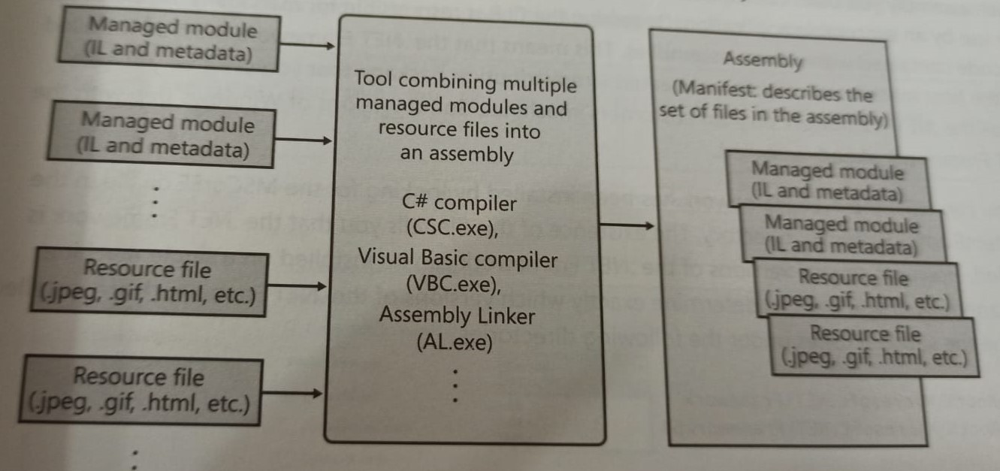

# clr-via-c-sharp
## Notes from CLR via C# written by Jeffrey Richter

### This repository contains notes taken from book CLR via C#(Fourth Edition),written by Jeffrey Richter, with examples.

## Chapter 1

- CLR is just what its name says it is: a runtime that is usable by different and verified programming language.
- **CLR has no idea which programming language the developer used for the source code.**
- You can create source code files written in any programming language that supports the CLR.

**A managed module is a standard 32-bit Windows (P)ortable (E)xecutable (PE32) file or a standard 64bit Windows portable executable (PE32+) files** requires the CLR to execute.

**IL codeis sometimes referred to as managed code because CLR manages its execution**

### Metadata has many uses:
- Compiler can read metadata directly.
- Intellisense feature parses metadata to tell you.
- By specifiying the `CLR` command-line switch, the C++ compiler produces modules that contain managed code.

**C++ is unique in that it is the only compiler that allows the developer to write both managed and unmanaged code**

- **You can tell if .NET Framework has been installed by looking for the `MsCorEE.dll` file in the `%SystemRoot%System32` directory. The existence of this file tells you that .NET FW is installed.** 

- If you want to determine exactly which versions of the .NET FW are installed. Examine the subdirectories under the following directories.
    - `%SystemRoot%System32\Microsoft.NET\Framework`
    - `%SystemRoot%System32\Microsoft.NET\Framework64`

- .NET FW SDK includes a command-line utility called `CLRVer.exe` that shows all of the CLR versions installed on a machine.
- The utility can also show which version of CLR is being used by process

- Microsoft ships two SDK Command Line utilities `DumpBin.exe` and `CorFlags.exe`.

### `DumpBin.exe`
> The Microsoft COFF Binary File Dumper (DUMPBIN.EXE) displays information about Common Object File Format (COFF) binary files. You can use DUMPBIN to examine COFF object files, standard libraries of COFF objects, executable files, and dynamic-link libraries (DLLs).

e.g: `dumpbin.exe /all /out:dump-bin-out.txt DumpBinSample.exe`

gives dump output file.

### `CorFlag.exe`
> The CorFlags Conversion tool allows you to configure the CorFlags section of the header of a portable executable image.

### 64-bits versions of windows offer a terminology that allows 32-bit Windows application to run. This technology is called `WoW64 (Windows On Windows64)`

- ### After Windows has examined the EXE's file header to determine whether to create 32-bit or 64 bit process, Windows loads the `x86`, `x64` or `ARM` versions of `MsCorEE.dll` into process address space.

# Continue from Page-4 of the notes.